# 🧠 Retrieval-Augmented Resource (RAR)

[](https://www.python.org/downloads/)
[](https://python.langchain.com/)
[](https://ai.google.dev/)
[](LICENSE)

> **Transform any collection of documents into an intelligent, conversational knowledge base with the power of RAG (Retrieval-Augmented Generation) and Google's Gemini AI.**

---

## 🚀 What is RAR?

**Retrieval-Augmented Resource (RAR)** is a simple CLI application that lets you chat with your documents using AI. It converts your files into searchable knowledge bases using RAG (Retrieval-Augmented Generation) technology.

> 🎓 **Learning Project**: This repository was created as a self-directed learning project to explore LangChain, Google Gemini, and agentic AI system development. It serves as both a functional tool and an educational resource for understanding modern RAG implementations.

### ✨ Key Features

- **🔍 Multi-Format Support**: PDF, TXT, MD, CSV, HTML, JSON, DOCX
- **🧠 Text Chunking**: Splits documents with configurable overlap
- **⚡ Vector Search**: Semantic search using ChromaDB
- **🤖 Conversational AI**: Natural language querying with Google Gemini
- **🎨 Clean CLI**: Color-coded interface with progress tracking
- **🔧 Debug Mode**: See what's happening under the hood
- **📁 Batch Processing**: Handle multiple files at once
- **💾 Local Storage**: Your knowledge bases are saved locally

---

## 🎯 Use Cases

### 📚 **Research & Academia**
Turn research papers, notes, and academic resources into a searchable knowledge base.

### 💼 **Business Documents**
Convert company documents, reports, and policies into a queryable system.

### 📖 **Documentation**
Make technical documentation, manuals, and guides easier to search through.

### 🎮 **Content Analysis**
Search through collections of articles, transcripts, or other text content.

### 🔍 **Document Search**
Query documents, case studies, and reports with natural language.

---

## 🏗️ How It Works

RAR uses a straightforward **Retrieval-Augmented Generation (RAG)** approach:

```mermaid
graph LR
    A[📄 Documents] --> B[🔨 Text Splitting]
    B --> C[🧮 Embeddings]
    C --> D[🗄️ Vector Store]
    D --> E[🔍 Semantic Search]
    E --> F[🤖 AI Response]
```



1. **Document Loading**: Load and parse various file formats
2. **Text Chunking**: Split text into smaller, manageable segments
3. **Vector Embeddings**: Convert text chunks into searchable vectors
4. **Vector Storage**: Store embeddings in ChromaDB for retrieval
5. **Semantic Search**: Find relevant content based on your questions
6. **AI Response**: Use Gemini to generate answers from the retrieved content

---

## 🛠️ Installation & Setup

### Prerequisites

- **Python 3.8+**
- **Google AI API Key** (Get one at [Google AI Studio](https://makersuite.google.com/app/apikey))

### Step 1: Clone the Repository

```bash
git clone https://github.com/yourusername/retrieval-augmented-resource.git
cd retrieval-augmented-resource
```

### Step 2: Install Dependencies

```bash
pip install -r requirements.txt
```

### Step 3: Set Up Environment Variables

Create a `.env` file or set the environment variable:

```bash
# Windows (Command Prompt)
set GOOGLE_API_KEY=your_api_key_here

# Windows (PowerShell)
$env:GOOGLE_API_KEY="your_api_key_here"

# macOS/Linux
export GOOGLE_API_KEY=your_api_key_here
```

### Step 4: Configure Models (Optional)

Edit `core/config.py` to customize:

```python
# Model Configuration
GEMINI_EMBEDDING_MODEL_NAME = "models/embedding-001"  # or "models/text-embedding-004"
GEMINI_CHAT_MODEL_NAME = "gemini-2.5-flash-lite-preview-06-17"

# Processing Settings
CHUNK_SIZE = 1000              # Text chunk size
CHUNK_OVERLAP = 200            # Overlap between chunks
CHAT_MODEL_TEMPERATURE = 0.2   # Response creativity (0.0-1.0)
```

> ⚠️ **Important**: If you change the embedding model (`GEMINI_EMBEDDING_MODEL_NAME`), previously created vector stores will not function correctly due to embedding dimension mismatches. You'll need to recreate any existing vector stores with the new embedding model.

---

## 🎮 Quick Start Guide

### Launch the Application

```bash
python run.py
```

### Create Your First Knowledge Base

1. **Select Option 1**: Create a new vector store
2. **Enter File/Folder Path**: Point to your documents
   ```
   Enter file or folder path: /path/to/your/documents
   ```
3. **Name Your Store**: Give it a memorable name
   ```
   Enter a name for the vector store: My Research Papers
   ```
4. **Add Description** (optional):
   ```
   Enter a description: Collection of AI research papers from 2024
   ```

### Start Chatting

1. **Select Option 2**: Chat with existing vector store
2. **Choose Your Store**: Select from the numbered list
3. **Ask Questions**: Start with natural language queries
   ```
   [USER] What are the main findings about transformer architectures?
   [CHAT] Based on the documents, the main findings about transformer architectures include...
   ```

### Pro Tips 💡

- **Large Collections**: For 500+ files, consider using the file limit feature to test with smaller batches first
- **Debug Mode**: Toggle debug mode (Option 3) to see retrieved documents and processing details
- **Exit Chat**: Type `:exit` to return to the main menu
- **Interrupt**: Use `Ctrl+C` to safely exit at any time

---

## 🔧 Advanced Configuration

### Batch Processing

For large document collections:

```python
# Recommended settings for large collections
CHUNK_SIZE = 1500           # Larger chunks for better context
CHUNK_OVERLAP = 300         # More overlap for continuity
```

### Search Optimization

Customize retrieval in `vector_store.py`:

```python
# Adjust search parameters
search_kwargs = {
    "k": 6,                 # Return top 6 most relevant chunks
    "score_threshold": 0.7  # Minimum similarity threshold
}
```

---

## 📊 Performance & Limits

| Metric | Recommendation | Notes |
|--------|---------------|-------|
| **Files per Store** | < 2,000 | Works best with smaller collections |
| **File Size** | < 20MB each | Large files are automatically chunked |
| **Chunk Size** | 1000-1500 tokens | Balance between context and precision |
| **API Calls** | ~1 per chunk + queries | Monitor your Google AI quota |

---

## 🐛 Troubleshooting

### Common Issues

**❌ API Key Error**
```
Error: Failed to initialize embeddings
```
**✅ Solution**: Verify your `GOOGLE_API_KEY` environment variable

**❌ Out of Memory**
```
Process terminated unexpectedly
```
**✅ Solution**: Enable file limiting for large collections

**❌ No Documents Found**
```
No supported documents found
```
**✅ Solution**: Ensure files are in supported formats (PDF, TXT, MD, CSV, HTML, JSON, DOCX)

### Debug Mode

Enable debug mode to see detailed processing information:
- Retrieved document chunks
- Tool call details
- Verbose execution logs

---

## 🤝 Contributing

We welcome contributions! Here's how you can help:

1. **🐛 Bug Reports**: Open an issue with detailed reproduction steps
2. **💡 Feature Requests**: Suggest new capabilities or improvements
3. **🔧 Code Contributions**: Fork, develop, and submit pull requests
4. **📚 Documentation**: Help improve guides and examples

---

## 📜 License

This project is licensed under the MIT License - see the [LICENSE](LICENSE) file for details.

---

## 🙏 Acknowledgments

- **[LangChain](https://python.langchain.com/)** for the RAG framework
- **[Google AI](https://ai.google.dev/)** for Gemini models
- **[ChromaDB](https://www.trychroma.com/)** for vector storage
- **[Unstructured](https://unstructured.io/)** for document processing

---

<div align="center">

**Made with ❤️ for the AI community**

[⭐ Star this repo](https://github.com/yourusername/retrieval-augmented-resource) • [🐛 Report issues](https://github.com/yourusername/retrieval-augmented-resource/issues) • [💡 Request features](https://github.com/yourusername/retrieval-augmented-resource/discussions)

</div>
