# 🧠 Retrieval-Augmented Resource (RAR)

[](https://www.python.org/downloads/)
[](https://langchain-ai.github.io/langgraph/)
[](https://python.langchain.com/)
[](https://ai.google.dev/)
[]()
[](LICENSE)

> **A simple CLI application for chatting with your documents using RAG and Google's Gemini AI.**

---

## 🚀 What is RAR?

**Retrieval-Augmented Resource (RAR)** is a CLI application that lets you chat with your documents. Upload files, ask questions, and get AI-powered answers based on your content.

> 🎓 **Learning Project**: This is a self-directed learning project exploring LangGraph, LangChain, and RAG implementations. It demonstrates how to build a conversational document query system using modern AI tools.

### ✨ Features

- **Multi-Format Support**: PDF, TXT, MD, CSV, HTML, JSON, DOCX
- **Semantic Search**: Find relevant content using vector embeddings  
- **Conversational Memory**: Maintains context across questions
- **Local Storage**: Vector stores saved to your machine
- **Debug Mode**: View retrieval and processing details
- **Batch Processing**: Handle multiple files simultaneously

---

## 🎯 Use Cases

- **Research**: Query academic papers and notes
- **Documentation**: Search technical manuals and guides  
- **Business**: Query company documents and reports
- **Content Analysis**: Search articles and transcripts

---

## 🏗️ How It Works

RAR uses **LangGraph** to orchestrate a **Retrieval-Augmented Generation (RAG)** workflow:

```mermaid
graph LR
    A[📄 Documents] --> B[🔨 Text Splitting]
    B --> C[🧮 Embeddings]
    C --> D[🗄️ Vector Store]
    D --> E[🔍 Semantic Search]
    E --> F[🤖 LangGraph Agent]
    F --> G[💬 AI Response]
```



1. **Document Processing**: Load and split documents into chunks
2. **Vector Embeddings**: Convert text chunks to searchable vectors (ChromaDB)
3. **LangGraph Agent**: Manages the conversation flow and tool calling
4. **Semantic Retrieval**: Find relevant chunks for each question
5. **Response Generation**: Use Gemini to answer based on retrieved content
6. **Memory Persistence**: Maintain conversation history across questions

---

## 🛠️ Installation & Setup

### Prerequisites

- **Python 3.8+**
- **Google AI API Key** (Get one at [Google AI Studio](https://makersuite.google.com/app/apikey))

### Step 1: Clone the Repository

```bash
git clone https://github.com/yourusername/retrieval-augmented-resource.git
cd retrieval-augmented-resource
```

### Step 2: Install Dependencies

```bash
pip install -r requirements.txt
```

### Step 3: Set Up Environment Variables

Create a `.env` file or set the environment variable:

```bash
# Windows (Command Prompt)
set GOOGLE_API_KEY=your_api_key_here

# Windows (PowerShell)
$env:GOOGLE_API_KEY="your_api_key_here"

# macOS/Linux
export GOOGLE_API_KEY=your_api_key_here
```

### Step 4: Configure Models (Optional)

Edit `core/config.py` to customize:

```python
# Model Configuration
GEMINI_EMBEDDING_MODEL_NAME = "models/embedding-001"
GEMINI_CHAT_MODEL_NAME = "gemini-2.5-flash-lite-preview-06-17"

# Processing Settings
CHUNK_SIZE = 1000              # Text chunk size
CHUNK_OVERLAP = 200            # Overlap between chunks
CHAT_MODEL_TEMPERATURE = 0.2   # Response creativity (0.0-1.0)
```

> ⚠️ **Note**: Changing embedding models requires recreating existing vector stores due to dimension mismatches.

---

## 🎮 Quick Start Guide

### Launch the Application

```bash
python run.py
```

### Create Your First Knowledge Base

1. **Select Option 1**: Create a new vector store
2. **Enter File/Folder Path**: Point to your documents
3. **Name Your Store**: Give it a memorable name  
4. **Add Description** (optional)

### Start Chatting

1. **Select Option 2**: Chat with existing vector store
2. **Choose Your Store**: Select from the numbered list
3. **Ask Questions**: Natural language queries about your documents

### Menu Options

- **Option 1**: Create new vector store
- **Option 2**: Chat with existing store  
- **Option 3**: Delete a vector store
- **Option 4**: Toggle debug mode
- **Option 5**: Exit

### Tips

- **Large Collections**: Use file limits for 500+ files to avoid long processing times
- **Debug Mode**: See retrieved documents and tool execution details
- **Exit Chat**: Type `:exit` to return to main menu

---

## 🔧 Configuration

### Batch Processing Settings

```python
# For large document collections
CHUNK_SIZE = 1500           # Larger chunks for better context
CHUNK_OVERLAP = 300         # More overlap for continuity
```

### Search Parameters

```python
# Adjust retrieval in vector_store.py
search_kwargs = {
    "k": 6,                 # Return top 6 chunks
    "score_threshold": 0.7  # Minimum similarity
}
```

---

## 📊 Performance Notes

| Aspect | Recommendation |
|--------|---------------|
| **Files per Store** | < 1,000 for best performance |
| **File Size** | < 20MB each (auto-chunked) |
| **Chunk Size** | 1000-1500 tokens |
| **API Usage** | ~1 call per chunk + queries |

---

## 🐛 Troubleshooting

**API Key Error**
- Verify your `GOOGLE_API_KEY` environment variable is set

**Out of Memory**  
- Enable file limiting for large collections

**No Documents Found**
- Ensure files are in supported formats: PDF, TXT, MD, CSV, HTML, JSON, DOCX

**Debug Mode**
- Enable to see retrieved chunks, tool calls, and execution details

---

## 🤝 Contributing

Contributions welcome! This is a learning project, so:

- **Bug Reports**: Open issues with reproduction steps
- **Feature Ideas**: Suggest improvements  
- **Code**: Fork, develop, submit PRs
- **Documentation**: Help improve clarity

---

## 📜 License

MIT License - see [LICENSE](LICENSE) for details.

---

## 🙏 Acknowledgments

- **[LangGraph](https://langchain-ai.github.io/langgraph/)** for agent orchestration
- **[LangChain](https://python.langchain.com/)** for RAG framework  
- **[Google AI](https://ai.google.dev/)** for Gemini models
- **[ChromaDB](https://www.trychroma.com/)** for vector storage

---

<div align="center">

**A simple learning project for exploring RAG and LangGraph**

[⭐ Star this repo](https://github.com/yourusername/retrieval-augmented-resource) • [🐛 Report issues](https://github.com/yourusername/retrieval-augmented-resource/issues)

</div>
